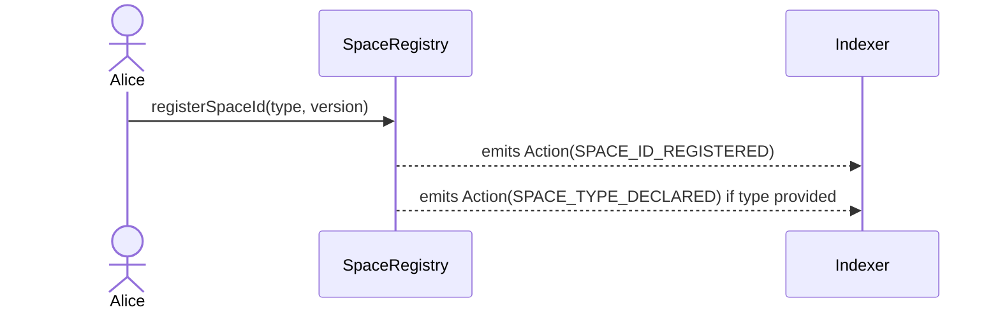
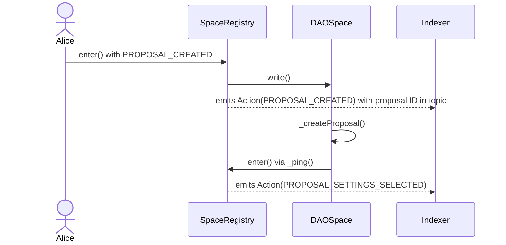
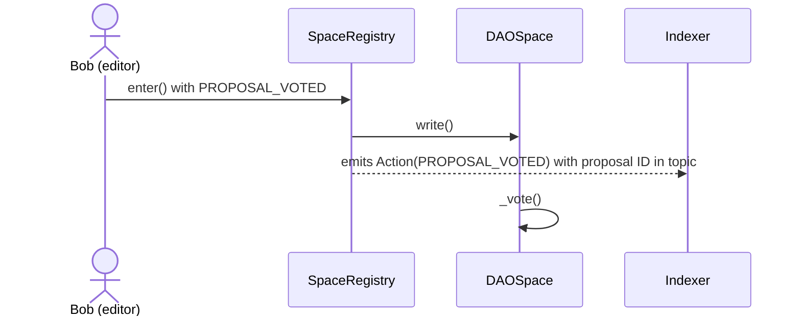
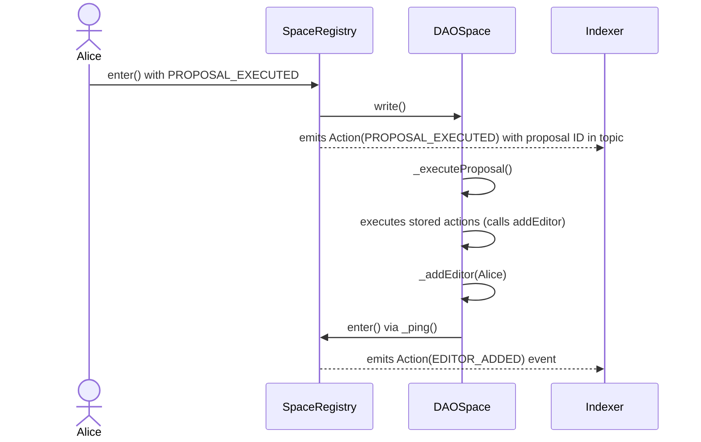
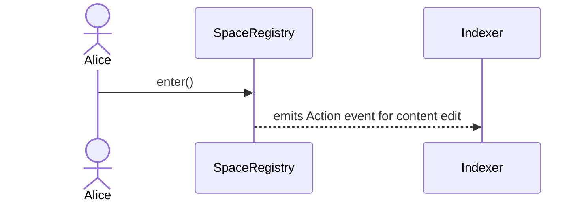
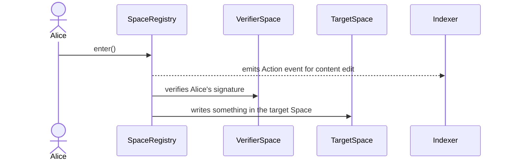
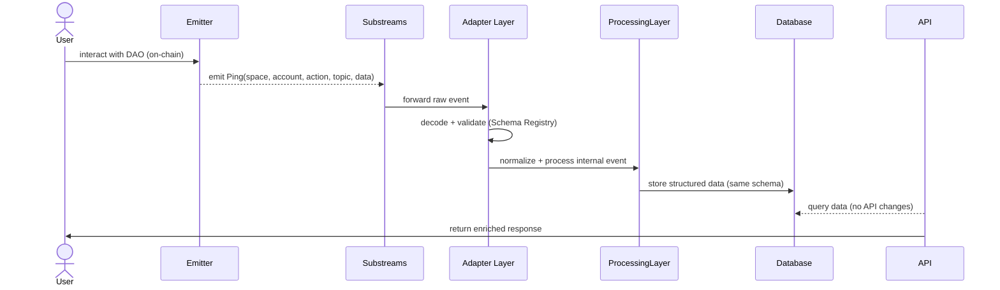

# Background And General

The revised smart contract architecture outlined below will simplify, standardise, and increase the robustness of the Geo governance contracts. This will occur in several ways, the first of which is the complete removal of the [Aragon OSx DAO contract apparatus](https://github.com/aragon/osx-plugin-template-foundry), which has thus far added significant complexity to the design. Secondly, this new architecture will revolve around a single contract, the `SpaceRegistry`, that acts as both the entry-point for users, and the source of a single standardised `Action` event to be decoded by the offchain indexer. This redesign will greatly reduce the load on the indexer from listening to many contracts with many events to one contract with one event. Thirdly, spaces and accounts will be designed as standardised and modular contracts, which will both allow for a powerful range of governance options while maintaining system simplicity centred around the `SpaceRegistry`.

For more information regarding the motivating principles behind this design, please consult the associated idea draft: [Geo Architecture Proposal](https://www.notion.so/Geo-Architecture-Proposal-2879a4c092c780829a73e2546423537e?pvs=21) 

## **Requirements**

- Remove all Aragon OSx dependencies and contracts
- Create the new L3 architecture contracts
    - Space Registry
    - DAO Space Factory
    - DAO Space
    - Verifier Space Factory
    - Verifier Space
- Update the Indexer to interpret the `Action` event.
- Deployment scripts
- E2E tests

# In-Depth

The singleton `SpaceRegistry` contract acts as a funnel for user interactions and the emission of events to the indexer. Standardised `DAOSpaces` will replicate the current governance and space management logic from the Aragon plugins, while maintaining modularity for alternative governance and Space designs. Whereas, Standardised `VerifierSpaces` will allow users with EOAs or DAOs to control multiple Spaces simultaneously.

### Eliminating the Personal vs Standard Space Distinction

Under the previous Aragon architecture there was a distinction drawn, and two sets of plugin contracts for, personal and standard spaces. This divergence was confusing and caused a significant amount of code re-use. Instead, what were previously personal spaces will now be handled by user’s EOAs or smart accounts. More specifically, users with an EOA can register a space ID using their address, and use the SpaceRegistry to emit `Action` events regarding changes they wish to make over their Space. 

### Space UUIDs

Space universal unique identifiers (`bytes16` UUIDs) will continue to be used in accordance with the previous architecture. These Space Ids will allow the offchain indexer to identify Spaces over time, while allowing those Spaces to change the address, and thus logic, associated with each. In this way, and through the use of the `SpaceRegistry`, Spaces can registry novel Space Ids and migrate them while maintaining a single identity in the knowledge graph.

This 1:1 relation between an address and a SpaceId is needed to create a stable and persistent identity for a Space, regardless of the contract or account controlling it. In this way, a Space Id allows users and the off-chain indexer to track the space's identity over time, even if the associated address and its underlying logic are migrated to a new contract or EOA.

### Actions and the Web Of Trust

Consolidating previous thinking around the Web of Trust (WoT), and leveraging the existing work that has been undertaken for GEO Actions, all WoT and former Action events will now be `Action` events emitted from the `SpaceRegistry`. This is to say that, for example, former up and down-voting actions will be incorporated as a type of `Action` event. So too, will WoT events such as a Space verifying that another Space is a sub-Space or that it can be trusted.

A full taxonomy of `Action` events, along with standardised formatting rules, can be accessed here: [GEO Action Definitions - V1](https://www.notion.so/GEO-Action-Definitions-V1-2999a4c092c780bb9f88cd8705c12898?pvs=21)  

<aside>
⚠️

What is presented below is neither the final nor the exhaustive implementation; however, it serves as a reference for how the contracts are intended to work.

</aside>

## Smart Contracts

The most significant smart contract work will be related to the `DAOSpace` contracts which must be disentangled from the Aragon OSx framework, while maintaining the desired current functionality.

<aside>
💡

In all sequence diagrams, all function calls shown are effectively delegated to the underlying implementation contract via the UUPS proxy pattern. These delegate calls are omitted for clarity.

</aside>

### Space Registry

The singleton `SpaceRegistry` contract will be at the core of this new smart contract architecture, and the generalised entry point for all users across all Spaces.

This contract will serve two core purposes:

- Generalised entry-point and emitter of the `Action` event.
- Repository for spaceIds, creating a bi-directional mapping between `addresses` and `bytes16s`.

Taking each functional role in turn, the `SpaceRegistry` has a key external function with no access control, `enter`, which processes actions in the following sequence:

- Call `verify` on the `from` address/contract if `_from ≠ msg.sender`
    - This function provides Spaces with the potential for an alternative verification mechanism beyond public-private key pairings or the use of a smart account.
        - For instance, a Wonderland Space could use this functionality to allow Alice, Bob, and Charlie to represent Wonderland, as Wonderland, in other Spaces.
- For permissionless actions: Emit the `Action` event and return (no further execution).
- For other actions:
    - Call `fetch` on the `to` address/contract if `_to ≠ msg.sender` to retrieve output variables for the event.
    - Emit the `Action` event that the offchain indexer will interpret.
        - This event is the only type of event that this contract will emit.
    - Call `write` on the `to` address/contract if `_to ≠ msg.sender`
        - This function allows for onchain execution to occur in the `_to` Space.

```solidity
/**
 * @notice Emitted when a user calls the enter function
 * @param fromId The from space ID involved
 * @param toId The to space ID involved
 * @param action An action, which is passed to the space contract
 * @param topic A topic, which is passed to the space contract
 * @param data Some arbitrary data for space contract execution
 */
event Action(
  bytes16 indexed fromId,
  bytes16 indexed toId,
  bytes32 indexed action,
  bytes32 indexed topic, 
  bytes data
) anonymous;
```

In addition to this, the `SpaceRegistry` will manage the bi-directional mapping of addresses to spaceIds. SpaceIds can be generated deterministically using the `generateSpaceId` function, and registered using the `registerSpaceId`. Importantly, spaces (users or DAOs) can migrate the address associated with a spaceId away from the original address that was used to create it with the `proposeSpaceMigration` and `acceptSpaceMigration` functions. In this way, users with an EOA or DAOs with a governance contract can migrate to a new EOA or governance contract while retaining the same spaceId in the GEO system.

The `SpaceRegistry` also supports permissionless actions, which are actions that do not require on-chain execution (no `fetch` or `write` calls). These are useful for purely informational events like upvotes, downvotes, and comments. During initialization, the following permissionless actions are automatically registered: `UPVOTED`, `DOWNVOTED`, `UNVOTED`, and `COMMENTED`. Additional permissionless actions can be added or removed by the contract owner using `setPermissionlessAction`.

This contract uses [ERC-7201 ****Namespaced Storage](https://rareskills.io/post/erc-7201) and is proxy upgradeable via the UUPS pattern.

Key functions:

- `enter()` - Main entry point that emits `Action` events and routes to space contracts. It first calls `verify` on the `from` space (if `_from ≠ msg.sender`). For permissionless actions, it only emits the event without calling `fetch` or `write`. For other actions, it calls `fetch` on the `to` space (if `_to ≠ msg.sender`) to get output variables, emits the event, then calls `write` on the `to` space (if `_to ≠ msg.sender`).
- `registerSpaceId(bytes32 _type, bytes calldata _version)` - Registers a new space ID for the caller. Optionally accepts a type and version to declare the space type.
- `clearSpaceId()` - Allows a space to clear its registration, disconnecting the address from its space ID.
- `proposeSpaceMigration(address _newAccount)` - Allows a space to propose migrating its space ID to a new address.
- `acceptSpaceMigration(bytes16 _spaceId, bytes32 _type, bytes calldata _version)` - Allows the proposed new address to accept the migration.
- `generateSpaceId(address _account, uint256 _nonce)` - Deterministically generates a space ID using the account address, nonce, and chain ID.
- `setPermissionlessAction(bytes32 _action, bool _isPermissionless)` - Owner-only function to add or remove permissionless actions.

<aside>
💡

Normally, events are emitted after execution occurs, however in this case the `Action` event is emitted first before Space execution and account verification. There are several reasons for this:

- By placing the `Action` event first, nested and re-entered calls into the `SpaceRegistry` will emit events in the expected pattern of operations. For instance, a user executing a successful proposal to add a new editor will first emit the `Action` event for the execution of the proposal, followed by a second emission for the addition of the new editor. Notice that if the `Action` event occurred after execution, this emission order would be reversed.
- To ensure that the `Action` event can also emit output variables where relevant, the `fetch` function will first retrieve output variables from the to Space before execution occurs with `write`.
</aside>

### Action Definitions

To assist and standardise the offchain indexer, action constants are defined in `ActionsConstants.sol`, which contains a set of `bytes32` constants that correspond to DAO `actions`. These constants follow a naming convention where governance actions are prefixed with `GOVERNANCE.` and permissionless actions are prefixed with `PERMISSIONLESS.`.

Key governance actions include: `PROPOSAL_CREATED`, `PROPOSAL_VOTED`, `PROPOSAL_EXECUTED`, `PROPOSAL_UPDATED`, `EDITOR_ADDED`, `EDITOR_REMOVED`, `MEMBER_ADDED`, `MEMBER_REMOVED`, `EDITOR_FLAGGED`, `EDITOR_UNFLAGGED`, `EDITS_PUBLISHED`, `FLAGGED`, `UNFLAGGED`, and space management actions like `SPACE_ID_REGISTERED`, `SPACE_ID_CLEARED`, `SPACE_ID_MIGRATED`, and `SPACE_TYPE_DECLARED`.

Permissionless actions (which don't require on-chain execution) include: `UPVOTED`, `DOWNVOTED`, `UNVOTED`, and `COMMENTED`. These are registered as permissionless during `SpaceRegistry` initialization and can be modified by the owner.

The complete list for the first version of event definitions, and rules for how to append definitions to the list, can be accessed here: [GEO Action Definitions - V1](https://www.notion.so/GEO-Action-Definitions-V1-2999a4c092c780bb9f88cd8705c12898?pvs=21) 

### DAO Space Factory

Each DAO Space will be created with a `DAOSpaceFactory` contract. This allows each `DAOSpace` to share the same logic and be universally upgradable via a beacon proxy pattern. The factory itself is also proxy upgradeable using UUPS and uses ERC-7201 namespaced storage.

The factory's `initialize()` function accepts the `SpaceRegistry`, owner address, and the DAO Space implementation address. It creates an `UpgradeableBeacon` pointing to the implementation, with the owner controlling upgrades.

The `createDAOSpaceProxy()` function deploys a new `BeaconProxy` for each DAO Space, initializing it with voting settings, initial editors, initial members, and optional initial content edits. The DAO Space automatically registers itself with the `SpaceRegistry` during initialization.

More information regarding the beacon proxy pattern can be accessed here: [Space Contract Changes V5](https://www.notion.so/Space-Contract-Changes-V5-280273e214eb80568a3ac213fa8c7e0b?pvs=21) 

### DAO Space

Each `DAOSpace`, in addition to being beacon upgradeable, will retain some of the logic that was present in the Aragon Standard Space governance plugins, although it will be unified into a single contract.

The primary entry-point for the DAOSpace contract will be the `write` function, which can only be called by the `SpaceRegistry`, thereby ensuring that all DAO operations must first occur through the `SpaceRegistry`. Within the `write` function, the `action` input variable is then used as a sorting mechanism to determine which internal function is to be called.

The DAOSpace implements a dual-path governance system:

- **Fast Path**: Threshold-based voting with immediate execution (flat count of yes votes). Only editors can create fast path proposals, and they are limited to a single action. Fast path proposals can execute immediately when the threshold is met (if a "Yes" vote reaches the threshold). A "No" vote on a fast path proposal escalates it to slow path, resetting the voting period and changing the threshold to the slow path percentage threshold.
- **Slow Path**: Majority voting with a voting window (percentage threshold). Members or editors can create slow path proposals, which can contain multiple actions. Slow path proposals require the voting period to end before execution.

Only a subset of all possible `DAOSpace` actions can be immediately accessed via the `write` function, other actions, such as adding or removing editors, must first pass through the governance process before they can be executed by the DAO.

There are, therefore, two kinds of functions within the DAOSpace contract:

- DAO governance functions that are open to members and editors to call via `write`:
    - `PROPOSAL_CREATED` - Create a proposal (fast or slow path)
    - `PROPOSAL_VOTED` - Vote on a proposal
    - `PROPOSAL_UPDATED` - Update a proposal (creator only, before execution)
    - `PROPOSAL_EXECUTED` - Execute a proposal (anyone can call once criteria met)
    - `SPACE_LEFT` - Leave the space as a member or editor
    - `EDITOR_FLAGGED` - Flag an editor (restricts fast path access)
- DAO-only functions that can only be called via the `DAOSpace` itself with `execute`, and thus a successful governance proposal:
    - `addMember` / `removeMember`
    - `addEditor` / `removeEditor` / `unflagEditor`
    - `updateVotingSettings`
    - `publish` - Publish content edits (takes topic, content URI, and metadata)
    - `flag` / `unflag` - Flag/unflag content (takes topic and flagged/unflagged ID)
    - `ping` - Re-enter SpaceRegistry to emit Action events

The contract uses ERC-7201 namespaced storage and supports proposal versioning, allowing proposals to be updated by their creator before execution. Proposals are identified by `bytes16` proposal IDs and can have multiple versions. The latest version is tracked separately, and all versions can be queried.

Key implementation details:

- The `write()` function routes actions to internal handlers: `PROPOSAL_CREATED`, `PROPOSAL_VOTED`, `PROPOSAL_UPDATED`, `PROPOSAL_EXECUTED`, `SPACE_LEFT`, and `EDITOR_FLAGGED`.
- The `verify()` function is disabled (always reverts) since DAO Spaces don't support off-chain signature verification.
- The `fetch()` function returns proposal IDs or other relevant data for emission in the `topic` field of `Action` events. For `PROPOSAL_CREATED`, `PROPOSAL_VOTED`, `PROPOSAL_UPDATED`, and `PROPOSAL_EXECUTED`, it returns the proposal ID. For `SPACE_LEFT`, it returns the role being left. For `EDITOR_FLAGGED`, it returns the flagged editor's address.
- Fast path proposals are limited to a single action and must use a valid action selector. By default, the following selectors are valid for fast path: `addMember`, `removeMember`, `publish`, `flag`, and `unflag`.
- Editors can be flagged, which prevents them from creating fast path proposals until unflagged.
- The DAO can re-enter the `SpaceRegistry` via the `ping()` function to emit additional `Action` events for operations like adding editors or publishing edits.

For more information regarding the dual-path governance design, please consult: [Research - Default Governance](https://www.notion.so/Research-Default-Governance-2959a4c092c7804998c4efc06cca0934?pvs=21) 

### Verifier Space Factory

Mirroring the features of the `DAOSpaceFactory`, the `VerifierSpaceFactory` is a proxy upgradeable contract that produces beacon proxy upgradeable `VerifierSpaces`. The factory uses ERC-7201 namespaced storage and is upgradeable via UUPS.

The factory's `initialize()` function accepts the `SpaceRegistry`, owner address, and the Verifier Space implementation address. It creates an `UpgradeableBeacon` pointing to the implementation, with the owner controlling upgrades.

The `createVerifierSpaceProxy()` function deploys a new `BeaconProxy` for each Verifier Space, initializing it with an owner address. The Verifier Space automatically registers itself with the `SpaceRegistry` during initialization.

### Verifier Space

In order to allow for an EOA (or a DAO) to control multiple Spaces simultaneously, a `VerifierSpace` contract validates offchain messages passed to the `SpaceRegistry` when `from ≠ msg.sender`. In this way, a user with a single EOA can deploy an arbitrary number of `VerifierSpaces` and extend the authority of one EOA across multiple Spaces simultaneously while retaining the 1:1 relation between an `address` and a `spaceId`.

The `VerifierSpace` uses EIP-712 for structured data signing. The `verify()` function constructs an EIP-712 typed data hash from the message parameters (toSpace, action, topic, keccak256(data), nonce) and validates that the owner's signature matches. A `replayNonce` is incremented after each successful verification to prevent signature replay attacks.

The `write()` function checks that the caller is the `SpaceRegistry` and that the `_fromSpace` is in the `validWriters` mapping. The owner can add or remove valid writers using `setValidWriters()`. By default, the owner and the contract itself are valid writers.

The contract uses ERC-7201 namespaced storage and is beacon upgradeable.

## Flows

To help make sense of this design, consider the following series of transactions for how editors in a DAO would vote on and execute the addition of a new editor.

First Alice, registers her EOA with the space registry, which allows her the ability to call enter and interact with other spaces via the registry.

### Alice registers a new space



### Alice Becomes A DAO Space Editor

Once in the DAO as a member, Alice creates a proposal to join the DAO as an editor. The proposal includes a proposal ID, voting mode (Fast or Slow), and an array of actions the DAO will perform if the proposal is successful (containing the call from the DAO to the DAO itself to add Alice as an editor).



Second, other editors in the DAO vote on this proposal according to the DAO’s pre-defined voting settings.



Third, and supposing that Alice’s proposal has passed the required threshold, Alice can execute this proposal that adds her as an editor to the DAO.



<aside>
📒

For simplicity we are supposing Alice and Bob use EOAs without any onchain verification and that the final vote and execution occur separately.

</aside>

### Alice Edits Her Personal Space

Expanding on how EOAs can be used for user’s personal spaces, consider this simple flow for a user to register and edit content on their own space using an EOA. 

To first register, Alice calls `registerSpaceId` to generate and broadcast a unique `bytes16` UUID for her new Space. Following this, Alice can call `enter` on the SpaceRegistry, she passes her own address as the `from` and `to` spaces, thereby avoiding any further onchain execution, and all that is emitted is the `Action` event for her content edit changes. 



### Alice Controls Ten Spaces With One EOA

Suppose Alice, with a single EOA, wants to create ten spaces and control them all with that EOA. In order to do this Alice would first use the `VerifierSpaceFactory` to create ten `VerifierSpaces`, with her EOA as the owner of all ten. 

From then on, Alice can call into the `SpaceRegistry`, specifying the `_fromSpace` as one of her newly created `VerifierSpaces`, as long as she includes a signed message of the payload. Because Alice’s EOA (the `msg.sender` in this call) does not equal the `fromSpace`, the `SpaceRegistry` will call `verify` on the `VerifierSpace` to ensure that she is allowed to emit the `Action` event. Because Alice is the owner of this `VerifierSpace` she is allowed, and in this way Alice, and only Alice, can control an arbitrary number of Spaces with a single EOA.



## Off-Chain

The offchain changes there are quite minimal. Since everything right now will go through the `SpaceRegistry` contract and a single `Action` event, this will simplify a lot the dynamic logic that we had for new Space contracts. 

## Indexer

The main change is to simplify the ingestion and decoding flow. Instead of listening to multiple contracts and event types, we’ll only track the `SpaceRegistry` contract and its `Action` events. Each `Action` has five fields, which will be decoded and validated before reaching the processing layer.

To achieve this, we’ll:

- Update the Substreams configuration to listen exclusively to the `SpaceRegistry` contract (similar to [this example](https://github.com/geobrowser/gaia/blob/f7ecd649eba18ef75f0dc29735bb491d7ff1677a/actions-substream/substreams.yaml#L30-L31)).
- Adjust the Substreams mappings so that only `Action` events are forwarded, instead of multiple event types. (similar to [this example](https://github.com/geobrowser/gaia/blob/f7ecd649eba18ef75f0dc29735bb491d7ff1677a/actions-substream/src/lib.rs#L11-L44))
- Add a preprocessing decode step where the payload and topic of each `Action` event are transformed into known internal structures. (probably implemented [here](https://github.com/geobrowser/gaia/blob/f7ecd649eba18ef75f0dc29735bb491d7ff1677a/indexer/src/preprocess.rs#L97-L98))

We’ll also introduce a **`Schema Registry`** alongside a lightweight set of **decoders**. The registry maps each action hash to its decoder and version, allowing the decoders to translate the raw topic and data into structured internal event types (e.g. `Vote`, `CreateProposal`). This ensures we don’t need to modify the database schema — once decoded and validated, the ingested data will have the same shape as it does today.



### API

API endpoints stay the same. The difference is only in how the pipeline interprets and enriches the incoming events.

## User Stories

### On-Chain Identity and Management

| User Story | Mechanism & Action Flow |
| --- | --- |
| Space Creation (DAO/EOA) | The EOA or DAO calls a Space Factory (`DAOSpaceFactory` or `VerifierSpaceFactory`). The Factory handles proxy deployment, initialization, and then calls `SpaceRegistry.registerSpaceId` to map the new contract address to a unique Space ID (UUID). |
| Multiple Space Control | The single EOA/DAO deploys and owns multiple Verifier Spaces. When acting on a Space's behalf, the EOA calls `SpaceRegistry.enter()` with a signed message. The registry calls `VerifierSpace.verify()`, which checks the signature against the EOA owner, authorizing the `Action` event emission and subsequent execution. |
| Identity Creation (Reader) | The reader calls `SpaceRegistry.registerSpaceId(EOA_address)`. This generates a deterministic `bytes16` Space ID (UUID) and registers the EOA, allowing the reader to use their personal wallet address as a Space identity without deploying a dedicated smart contract. |
| Leaving a Space | The member calls `SpaceRegistry.enter()` with the `from` address being their own and the `action` set to `SPACE_LEFT`. The registry emits the `Action` event, and then calls `DAOSpace.write()`, which executes the internal `_leave` function to remove the member's role and state. |
| Identity Migration | The current controller calls `SpaceRegistry.proposeSpaceMigration(newAddress)` to propose a migration. The new address then calls `SpaceRegistry.acceptSpaceMigration(spaceId, type, version)` to complete the migration. This updates the bi-directional mappings, allowing the Space ID to maintain its history across the address change. |

### DAO Governance

| User Story | Mechanism & Action Flow |
| --- | --- |
| Propose Edits | The member/editor calls `SpaceRegistry.enter()` with the `action` set to `PROPOSAL_CREATED` and includes the proposal ID, voting mode (Fast or Slow), and array of on-chain operations (`Action[]`) in the `data`. The registry emits the `Action` event, then calls `DAOSpace.write()`, which validates the role and initiates the proposal logic. |
| Vote on Proposals | The editor calls `SpaceRegistry.enter()` with the `action` set to `PROPOSAL_VOTED`, passing the proposal ID and vote option in the data. The registry emits the `Action` event, then calls `DAOSpace.write()`, which validates the editor role and executes the internal vote logic. Fast path proposals can execute immediately if threshold is met, or escalate to slow path on a "No" vote. |
| Execute Proposal | Any user calls `SpaceRegistry.enter()` with the `action` set to `PROPOSAL_EXECUTED`, passing the proposal ID in the data. The registry emits the initial `Action` event, then calls `DAOSpace.write()`. If the proposal passed, the stored on-chain operations are executed sequentially, potentially causing nested calls back into `SpaceRegistry.enter()` to emit additional `Action` events (e.g., for `EDITS_PUBLISHED`). |
| Update Proposal | The proposal creator calls `SpaceRegistry.enter()` with the `action` set to `PROPOSAL_UPDATED`, passing the proposal ID, new voting mode, and new actions. This creates a new version of the proposal, resetting votes but preserving the proposal ID. |
| Propose New Member/Editor/Subspace | The member or editor uses the `PROPOSAL_CREATED` action, embedding a call to the DAO-only functions (`addMember`, `addEditor`, etc.) as the on-chain operation within the proposal's data payload. This action is indexed, voted on, and only executed by the DAO itself upon successful passage. |
| Flag Editor | An editor calls `SpaceRegistry.enter()` with the `action` set to `EDITOR_FLAGGED`, passing the flagged editor's address. This restricts the flagged editor from creating fast path proposals until unflagged via governance. |

### KG Content

| User Story | Mechanism & Action Flow |
| --- | --- |
| Upvote or Downvote Content | The reader calls `SpaceRegistry.enter()` with their EOA/Space ID as the `from` and the target content's Space ID as the `to`, setting the `action` to `UPVOTED` or `DOWNVOTED`. Since these are permissionless actions, no on-chain execution occurs (no `fetch` or `write` calls), and the `Action` event is emitted immediately for the indexer to record the signal. |
| Read Space Content | The reader sends a read request to the off-chain API. The API queries the Knowledge Graph (populated by the indexer decoding `SpaceRegistry.Action` events) to retrieve content, state, or governance data. No on-chain transaction or event emission is required. |

# Resources

All of the additional resources referenced throughout this document are listed here:

- [Geo Architecture Proposal](https://www.notion.so/Geo-Architecture-Proposal-2879a4c092c780829a73e2546423537e?pvs=21)
- [GEO `Action` Definitions - V1](https://www.notion.so/GEO-Action-Definitions-V1-2a3273e214eb80f5b735f78c7cc2f6cf?pvs=21)
- [Space Contract Changes V5](https://www.notion.so/Space-Contract-Changes-V5-280273e214eb80568a3ac213fa8c7e0b?pvs=21)
- [Research - Default Governance](https://www.notion.so/Research-Default-Governance-2959a4c092c7804998c4efc06cca0934?pvs=21)

Geo Documentation

- [Subspace Governance: Onchain Tech Design [WIP]](https://www.notion.so/Subspace-Governance-Onchain-Tech-Design-WIP-294273e214eb80778f46f6abe8c6b508?pvs=21)
- [Spaces and Topics](https://www.notion.so/Spaces-and-Topics-29a273e214eb803488b6eed048fbdb04?pvs=21)

# Open Questions and Thoughts

- Need to think a little more about how forking would work, I think we can reuse the current governance design here though. We want an opt-in mechanism for users to leave a space but keep the history (at least offchain history) and create a new DAO.